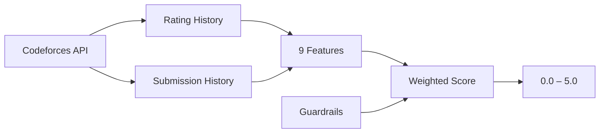

<div align="center">
  
  <h1>CF-Police</h1>
  <p><strong>Behavioral Anomaly Detection for Codeforces</strong></p>

  <!-- Badges -->
  <p>
    <a href="https://github.com/codewithayuu/cf-police/releases">
      
    </a>
    <a href="https://github.com/codewithayuu/cf-police/actions/workflows/release.yml">
      
    </a>
    <a href="https://github.com/codewithayuu/cf-police/blob/master/LICENSE">
      
    </a>
    
    
  </p>

  <p>
    
  </p>
</div>

---

## Overview

**CF-Police** is a browser extension that analyzes Codeforces user activity and flags potential cheating. It runs a full statistical engine **entirely client-side** — no server, no API keys, no data collection. Just install and browse.

### What It Looks Like

| Profile Page | Standings Page |
|---|---|
|  |  |
| Color-coded badge injects next to the username | "Check All" button evaluates every participant |

---

## Features

<div>
  <table>
    <tr>
      <td width="50%">
        <h3>🛡️ Profile Viewer</h3>
        <p>Visit any Codeforces profile — the extension automatically fetches their data and displays a color-coded anomaly score next to their name.</p>
      </td>
      <td width="50%">
        <h3>📊 Standings Scanner</h3>
        <p>In contest standings, a "Check All" button evaluates every participant with rate-limited API calls and color-coded results inline.</p>
      </td>
    </tr>
    <tr>
      <td width="50%">
        <h3>⚡ Fully Local</h3>
        <p>All scoring logic runs in your browser via <code>engine.js</code>. Zero data sent anywhere. Cached results prevent redundant API calls.</p>
      </td>
      <td width="50%">
        <h3>🚨 False Positive Reports</h3>
        <p>Flagged profiles get a one-click "Report False Positive" button that pre-fills a GitHub issue with the user's handle and score.</p>
      </td>
    </tr>
  </table>
</div>

---

## How It Works

The extension computes a **behavioral anomaly score (0.0–5.0)** using 9 features built from Codeforces public API data, plus 5 guardrail heuristics for obvious cheating patterns.



### Scoring Scale

| Score | Label | Color |
|---|---|---|
| 0.0 – 1.0 | Likely Genuine | 🟢 Green |
| 1.0 – 2.0 | Suspicious | 🟡 Yellow-Green |
| 2.0 – 3.0 | Maybe Cheated | 🟠 Yellow |
| 3.0 – 4.0 | Most Probably Cheated | 🔴 Orange |
| 4.0 – 5.0 | Cheater | 🔴 Red (pulsing) |

### Under the Hood: The Dual-Layer Engine

The engine relies on a dual-layer architecture, combining **Statistical Distributions** (to measure how anomalous an account is compared to thousands of legitimate users) with **Hard Guardrail Heuristics** (to catch obvious, mathematically impossible cheating patterns).

#### Layer 1: Statistical Features (The "Weirdness" Score)
The engine fetches a user's entire submission and contest history, calculating several metrics and comparing them against a pre-compiled `baseline.json` containing the true means of legitimate Grandmasters, Masters, and Experts.
- **SMR (Speed to Milestone Ratio):** Measures how many contests it took to reach their max rating. If a user hits 2400 in just 8 contests, their SMR z-score will be extremely high because legitimate players usually take 60+ contests.
- **PCRI (Problem Count vs Rating Index):** Counts total unique problems solved. A real Grandmaster has usually grinded 1,500+ problems. Reaching 2300 rating with only 70 problems solved causes this index to spike.
- **SCRS (Single Contest Rating Spike):** Tracks the absolute maximum rating delta achieved in a single contest recently.
- **MDS (Max Difficulty Solved):** Scans submission history for the hardest problem successfully solved. A contest rating of 2200 with a historical max solved difficulty of 1400 triggers a massive mismatch flag.

These metrics are normalized into percentiles, weighted (e.g., SMR 20%, SCRS 10%), and combined into a baseline `rawScore`.

#### Layer 2: Guardrail Heuristics (The Rule-Based Catchers)
Because statistics can be fuzzy, the engine uses strict "Guardrails" to catch physically impossible behavior. Crucially, these only evaluate the user's **last 6 months** of activity to forgive past "smurfs" and prevent false positives.
- **Guardrail 1 (Sudden Rank Jump):** Tracks a sliding window of the user's average rank over their last 5 contests. If an established low-rated player (e.g., < 1600) suddenly places in the absolute Top 100 of a Div 1/2 contest, it triggers an instant +5.0 penalty.
- **Guardrail 2 (Sudden Difficulty Jump):** Tracks historical max difficulty. If a user who has never solved anything harder than a 1200 suddenly submits a flawless solution for a 2500-rated problem during a live contest, any jump > 800 rating points triggers a penalty.
- **Guardrail 3 (Unrealistic Growth / Speedrun):** Targets "burner" or smurf accounts. If an account has fewer than 15 lifetime contests, the engine calculates their average rating gain per contest. Averaging > 150 points gained per contest consistently flags them as a speedrunner.
- **Guardrail 4 (Out of League):** Checks live contest performance against an established rating constraint. If an established user with a historical max rating `< 1600` successfully submits a live contest problem that is rated `600+` points higher than their max rating, it calculates the discrepancy and applies a heavy penalty.
- **Guardrail 5 (Unrated Prodigy):** Flags brand-new accounts with exactly `0` lifetime contests. If an unrated account is somehow successfully solving `1700+` rated problems perfectly in virtual participation or practice, it instantly receives up to a +5.0 penalty.

The final score stacks the maximum triggered `guardrailPenalty` on top of the statistical `rawScore`, clipped between `0.0` and `5.0`.

---

## Installation

<div align="center">
  <table>
    <tr>
      <th align="center">Chrome / Edge (MV3)</th>
      <th align="center">Firefox (MV3)</th>
    </tr>
    <tr>
      <td align="center">
        <a href="https://github.com/codewithayuu/cf-police/releases">
          
        </a>
      </td>
      <td align="center">
        <a href="https://github.com/codewithayuu/cf-police/releases">
          
        </a>
      </td>
    </tr>
    <tr>
      <td>
        1. Download <code>cf-police-chrome.zip</code> from <a href="https://github.com/codewithayuu/cf-police/releases">Releases</a><br>
        2. Unzip the file<br>
        3. Go to <code>chrome://extensions</code><br>
        4. Enable <strong>Developer mode</strong><br>
        5. Click <strong>Load unpacked</strong> → select the folder
      </td>
      <td>
        1. Download <code>cf-police-firefox.zip</code> from <a href="https://github.com/codewithayuu/cf-police/releases">Releases</a><br>
        2. Unzip the file<br>
        3. Go to <code>about:debugging#/runtime/this-firefox</code><br>
        4. Click <strong>Load Temporary Add-on</strong><br>
        5. Select <code>manifest.json</code> from the folder
      </td>
    </tr>
  </table>
</div>

> **Note:** The extension is not on the Chrome Web Store or AMO yet. For now, install via Developer mode.

---

## Development

```bash
git clone https://github.com/codewithayuu/cf-police.git
cd cf-police/extension
```

Then load the `extension` folder as an unpacked extension in your browser. See [CONTRIBUTING.md](CONTRIBUTING.md) for more details.

---

## Release Process

1. Go to **Actions → Bump Version → Run workflow**
2. Pick `patch`, `minor`, or `major`
3. The workflow bumps the version, creates a tag, and the release workflow auto-builds `cf-police-chrome.zip` and `cf-police-firefox.zip`
4. A GitHub Release is created with both zips attached

---

## License

[MIT](LICENSE) © Ayush Jha
