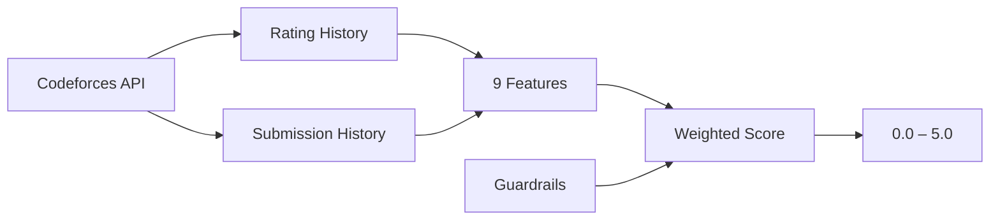

<div align="center">
  
  <h1>CF-Police</h1>
  <p><strong>Behavioral Anomaly Detection for Codeforces</strong></p>

  <!-- Badges -->
  <p>
    <a href="https://github.com/codewithayuu/cf-police/releases">
      
    </a>
    <a href="https://github.com/codewithayuu/cf-police/actions/workflows/release.yml">
      
    </a>
    <a href="https://github.com/codewithayuu/cf-police/blob/master/LICENSE">
      
    </a>
    
    
  </p>

  <p>
    
  </p>
</div>

---

## Overview

**CF-Police** is a browser extension that analyzes Codeforces user activity and flags potential cheating. It runs a full statistical engine **entirely client-side** — no server, no API keys, no data collection. Just install and browse.

### What It Looks Like

| Profile Page | Standings Page |
|---|---|
|  |  |
| Color-coded badge injects next to the username | "Check All" button evaluates every participant |

---

## Features

<div>
  <table>
    <tr>
      <td width="50%">
        <h3>🛡️ Profile Viewer</h3>
        <p>Visit any Codeforces profile — the extension automatically fetches their data and displays a color-coded anomaly score next to their name.</p>
      </td>
      <td width="50%">
        <h3>📊 Standings Scanner</h3>
        <p>In contest standings, a "Check All" button evaluates every participant with rate-limited API calls and color-coded results inline.</p>
      </td>
    </tr>
    <tr>
      <td width="50%">
        <h3>⚡ Fully Local</h3>
        <p>All scoring logic runs in your browser via <code>engine.js</code>. Zero data sent anywhere. Cached results prevent redundant API calls.</p>
      </td>
      <td width="50%">
        <h3>🚨 False Positive Reports</h3>
        <p>Flagged profiles get a one-click "Report False Positive" button that pre-fills a GitHub issue with the user's handle and score.</p>
      </td>
    </tr>
  </table>
</div>

---

## How It Works

The extension computes a **behavioral anomaly score (0.0–5.0)** using 9 features built from Codeforces public API data, plus 5 guardrail heuristics for obvious cheating patterns.



### Scoring Scale

| Score | Label | Color |
|---|---|---|
| 0.0 – 1.0 | Likely Genuine | 🟢 Green |
| 1.0 – 2.0 | Suspicious | 🟡 Yellow-Green |
| 2.0 – 3.0 | Maybe Cheated | 🟠 Yellow |
| 3.0 – 4.0 | Most Probably Cheated | 🔴 Orange |
| 4.0 – 5.0 | Cheater | 🔴 Red (pulsing) |

---

## Installation

<div align="center">
  <table>
    <tr>
      <th align="center">Chrome / Edge (MV3)</th>
      <th align="center">Firefox (MV3)</th>
    </tr>
    <tr>
      <td align="center">
        <a href="https://github.com/codewithayuu/cf-police/releases">
          
        </a>
      </td>
      <td align="center">
        <a href="https://github.com/codewithayuu/cf-police/releases">
          
        </a>
      </td>
    </tr>
    <tr>
      <td>
        1. Download <code>cf-police-chrome.zip</code> from <a href="https://github.com/codewithayuu/cf-police/releases">Releases</a><br>
        2. Unzip the file<br>
        3. Go to <code>chrome://extensions</code><br>
        4. Enable <strong>Developer mode</strong><br>
        5. Click <strong>Load unpacked</strong> → select the folder
      </td>
      <td>
        1. Download <code>cf-police-firefox.zip</code> from <a href="https://github.com/codewithayuu/cf-police/releases">Releases</a><br>
        2. Unzip the file<br>
        3. Go to <code>about:debugging#/runtime/this-firefox</code><br>
        4. Click <strong>Load Temporary Add-on</strong><br>
        5. Select <code>manifest.json</code> from the folder
      </td>
    </tr>
  </table>
</div>

> **Note:** The extension is not on the Chrome Web Store or AMO yet. For now, install via Developer mode.

---

## Development

```bash
git clone https://github.com/codewithayuu/cf-police.git
cd cf-police/extension
```

Then load the `extension` folder as an unpacked extension in your browser. See [CONTRIBUTING.md](CONTRIBUTING.md) for more details.

---

## Release Process

1. Go to **Actions → Bump Version → Run workflow**
2. Pick `patch`, `minor`, or `major`
3. The workflow bumps the version, creates a tag, and the release workflow auto-builds `cf-police-chrome.zip` and `cf-police-firefox.zip`
4. A GitHub Release is created with both zips attached

---

## License

[MIT](LICENSE) © Ayush Jha
